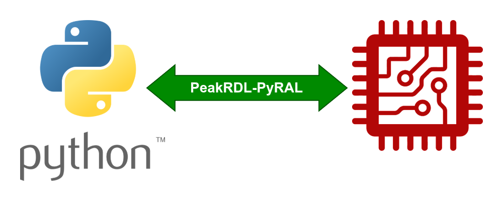

PeakRDL-PyRAL
=============

PeakRDL-PyRAL is a register abstraction layer (RAL) generator that provides a
lightweight Python interface to your hardware.

* SQLite3-based RAL back-end. Compact output.
* Scalable: Good for tiny designs to enormous SoCs. Loads quickly and keeps the memory footprint small.
* Fully typed RAL output. Enjoy the benefits of static type checking and autocomplete in popular Python IDEs.

Quick Start
-----------
PeakRDL-PyRAL comes in two components: The PeakRDL exporter tool, and the
runtime library.

1. Install PeakRDL-PyRAL:

.. code-block:: bash

   python3 -m pip install peakrdl-pyral[cli]
   python3 -m pip install peakrdl-pyral-runtime

2. Create a simple SystemRDL design:

.. code-block:: systemrdl
    :caption: example.rdl

    addrmap example {
        reg my_reg {
            field {} f1[7:0];
            field {} f2[15:8];
        };
        my_reg r1;
        my_reg r2;
    };

3. Generate the RAL

.. code-block:: bash

    peakrdl pyral example.rdl --rename example_ral -o .

4. Manipulate hardware!

.. code-block:: python

    from peakrdl_pyral_runtime.hwio.demo import DemoHWIO
    import example_ral

    ral = example_ral.get_ral()
    ral.attach_hwio(DemoHWIO()) # Attach to "fake" hardware for now

    # Read/write registers directly
    ral.r2.write(0x1234)
    print(ral.r2.read())

    # Field-aware read
    r = ral.r2.read_fields()
    print(r.f1)
    print(r.f2)

    # Field-aware write
    with ral.r2.write_fields() as r:
        r.f1 = 0xAB
        r.f2 = 0xCD

    # Pythonic read-modify-write
    with ral.r2.change_fields() as r:
        r.f1 = 123

Links
-----

- `Source repository <https://github.com/SystemRDL/PeakRDL-PyRAL>`_
- `Release Notes <https://github.com/SystemRDL/PeakRDL-PyRAL/releases>`_
- `Issue tracker <https://github.com/SystemRDL/PeakRDL-PyRAL/issues>`_
- `PyPI (Exporter) <https://pypi.org/project/peakrdl-pyral>`_
- `PyPI (Runtime) <https://pypi.org/project/peakrdl-pyral-runtime>`_
- `SystemRDL Specification <http://accellera.org/downloads/standards/systemrdl>`_

.. toctree::
    :hidden:

    self

.. toctree::
    :hidden:
    :caption: User's Guide

    ug/key-concepts
    ug/installing
    ug/grafting
    ug/hier-hwio

.. toctree::
    :hidden:
    :caption: Runtime API Reference

    api/ral
    api/hwio
