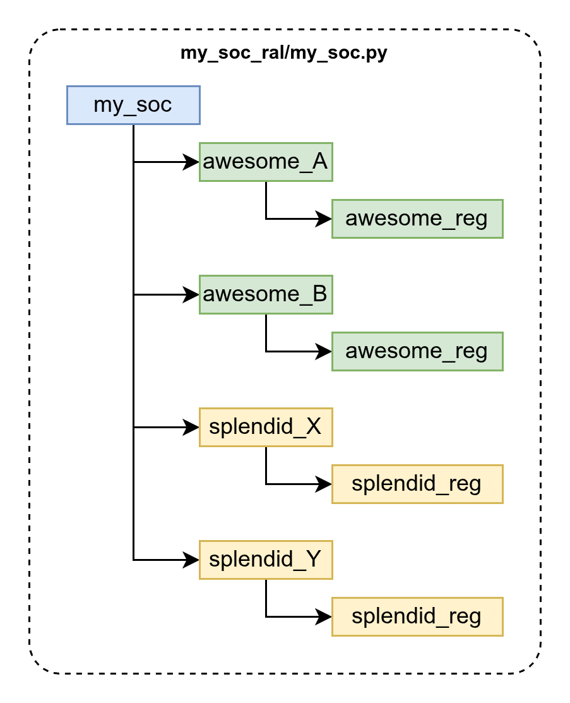
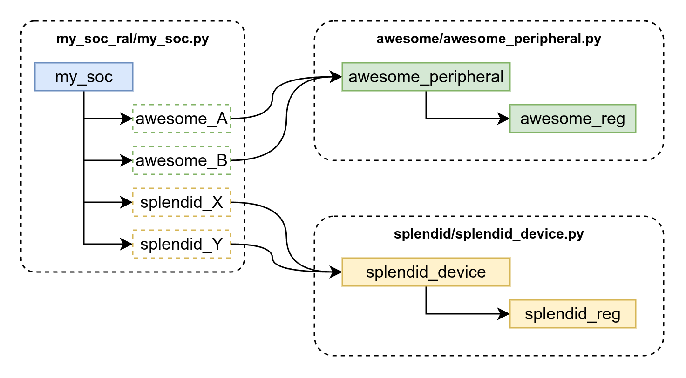

.. _ug-grafting:

Grafting together multiple RALs
===============================
This page describes **RAL Grafting** - a method of linking multiple smaller RALs
together.

For larger SoC designs, generating one monolithic PyRAL may not be the most
practical way to organize a project. It may be useful to generate smaller RALs
for individual subsystems, then stitch them together to a top-level RAL.

Doing so is useful for several reasons:

* Allows *vertical re-use*. A subsystem's RAL can be used in a smaller application
  component, and then re-used at the system-level.
* More flexible organization of your Python library. Keep RALs organized alongside
  the Python modules that use them.
* Enable incremental updates. No need to re-generate an entire system's RAL when
  only one sub-component changed.

Example 1: A Monolithic RAL
---------------------------
Consider the following set of SystemRDL files that define a system's address space:

.. code-block:: systemrdl
    :caption: awesome_peripheral.rdl

    addrmap awesome_peripheral {
        reg {
            field {} f1[7:0];
            field {} f2[15:8];
        } awesome_reg;
    };

.. code-block:: systemrdl
    :caption: splendid_device.rdl

    addrmap splendid_device {
        reg {
            field {} f1[7:0];
            field {} f2[15:8];
        } splendid_reg;
    };

.. code-block:: systemrdl
    :caption: my_soc.rdl

    addrmap my_soc {
        awesome_peripheral  awesome_A @ 0x10_0000;
        awesome_peripheral  awesome_B @ 0x20_0000;
        splendid_device     splendid_X @ 0x30_0000;
        splendid_device     splendid_Y @ 0x40_0000;
    };

One option would be to generate this using a single PyRAL export:

.. code-block:: bash

    mkdir my_soc_ral
    touch my_soc_ral/__init__.py

    peakrdl pyral \
        awesome_peripheral.rdl splendid_device.rdl my_soc.rdl \
        -o my_soc_ral/

This results in a monolithic RAL that could be visualized as follows:

Example 2: Grafting together multiple RALs
------------------------------------------

Building on Example 1 - What if I want to organize my application as follows:

* All Python code related to the ``awesome_peripheral`` is in a sub-folder ``awesome/``
* All Python code related to the ``splendid_device`` is in a sub-folder ``splendid/``
* Each of these sub-folders are `organized as packages <https://docs.python.org/3/tutorial/modules.html#packages>`_, containing an ``__init__.py`` file.
* Generate separate RALs for each, and graft them onto a top-level RAL that represents ``my_soc``

First, export each individual subsystem's RAL separately:

.. code-block:: bash

    peakrdl pyral awesome_peripheral.rdl -o awesome/
    peakrdl pyral splendid_device.rdl -o splendid/

Then, generate the top-level RAL, but instruct it to graft any nodes that match
the RDL type-names ``awesome_peripheral`` and ``splendid_device`` to their
respective Python import paths. Notice that the import paths are **relative** to
the location of the RAL module being exported.

.. code-block:: bash

    mkdir my_soc_ral
    touch my_soc_ral/__init__.py

    peakrdl pyral \
        awesome_peripheral.rdl splendid_device.rdl my_soc.rdl \
        -o my_soc_ral/ \
        --graft-type awesome_peripheral=..awesome.awesome_peripheral \
        --graft-type splendid_device=..splendid.splendid_device

The resulting file structure is:

.. code-block:: text

    example_2/
        __init__.py
        awesome/
            __init__.py
            awesome_peripheral.py
            awesome_peripheral.db
            awesome_peripheral_stubs.pyi
        splendid/
            __init__.py
            splendid_device.py
            splendid_device.db
            splendid_device_stubs.pyi
        my_soc_ral/
            __init__.py
            my_soc.py
            my_soc.db
            my_soc_stubs.pyi

And the resulting RAL can be visualized as follows:

Notice how the grafted RAL is functionally identical to the monolithic one from
the prior example. Import the top-level RAL, and seamlessly reference the
grafted subsystems:

.. code-block:: python

    from my_soc_ral import my_soc

    ral = my_soc.get_ral()
    ral.awesome_A.awesome_reg
    ral.awesome_B.awesome_reg
    ral.splendid_X.splendid_reg
    ral.splendid_Y.splendid_reg
