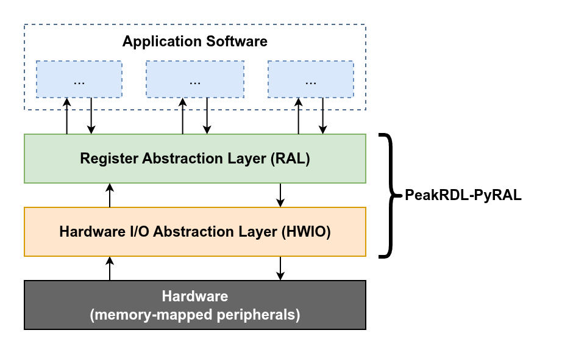

Key Concepts
============

Abstraction Layers
------------------

PeakRDL-PyRAL implements two major abstraction layers: The RAL and HWIO.

Hardware I/O Abstraction Layer (HWIO)
    The HWIO layer defines how low-level read/write operations are initiated on
    the hardware. A HWIO layer may issue these accesses locally via a direct
    memory mapping, via a hardware debugger like JTAG, or even remotely through
    an SSH or telnet connection. Alternatively it could call read/write operations
    on a bus driver in a simulated environment like cocotb.

    The PyRAL runtime provides several built-in HWIO implementations.
    See the :ref:`api-hwio` page for more details.

Register Abstraction Layer (RAL)
    The RAL provides a user-friendly API to the device's address space. Rather
    than manipulating registers using cryptic address offsets and cumbersome
    bit-manipulation operations, application software can manipulate registers
    and fields more intuitively by-name.

    The PeakRDL-PyRAL exporter auto-generates this RAL based on your SystemRDL input.
    For more details about how to use the RAL, see the :ref:`api-ral` page.

Generating the RAL
------------------
The easiest way to generate the Python RAL is using the PeakRDL command-line:

.. code-block:: bash

    peakrdl pyral <input RDL files> -o path/to/output/dir/

.. note::

    The exporter will automatically check the contents of the output directory
    to infer whether the RAL shall use relative or absolute Python imports.
    If the output directory contains an ``__init__.py`` file, then it will assume
    that it is part of a Python package and will use relative imports.

What gets generated
-------------------

The above command results in three files generated in the output directory:

<module>.db
    This is a binary sqlite3 database file that contains the RAL definition.
    This shall be in the same folder as the counterpart ``<module>.py`` file.

    The contents and organization of this database is not considered part of the
    public API as it may change in future revisions.

<module>.py
    This module provides a ``get_ral()`` factory function that creates an
    instance of the RAL. Use this from your application software to construct it.

<module>._stubs.pyi
    Since the RAL is not represented as Python code, IDEs would normally not be
    able to infer type information about the generated RAL.
    This type stubs file provides type hint information about the RAL so that
    static type checkers like Mypy can verify your code, and popular IDEs provide
    auto-completion while you type.
